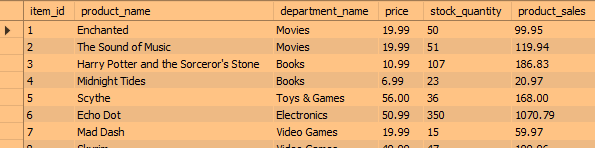
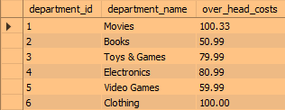
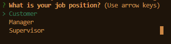
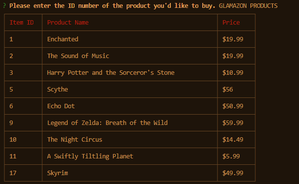
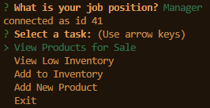
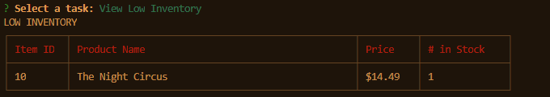
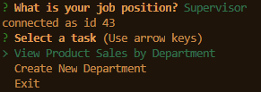
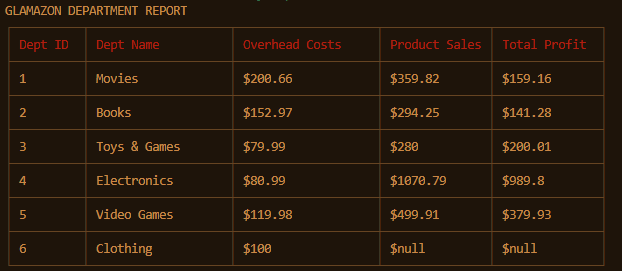

# glamazon-db
baby's first database

Project link:
https://github.com/noracbyrd/glamazon-db

# Glamazon

## Overview

This project creates a mock online retail store, modeled after one that rhymes with...Glamazon...
To interact with the store, you first select your position: Customer, Manager, or Supervisor. Each position has its own commands and access points. The entire store is run via the command line interface. The data is stored in the Glamazon database. There are two tables in the database: products and departments. 

Products Table:

Departments Table:

Getting started demo:
https://drive.google.com/file/d/19NiDD8SguUd60ucVNb0OadV28-qoxvNK/view

## User Input

User input is managed by Inquirer. In most cases, validation is included to make sure that the correct type of data is being entered.

## Positions

## 1. Customer

The Customer position behaves as a customer would - the user is first presented with a view of the available products and is then prompted to select which item id they would like to purchase and how many they would like to purchase. The table of available products displays the product id, product name, and price.

### Customer - Successful Purchase
If there are enough items that the user wants in stock, the purchase goes through. The Glamazon database is updated with the diminished stock and increased product sales, and the console displays how much the user spent.

Demo:
https://drive.google.com/file/d/1CZBBsojyiYuDbtoCBRdxeRuRPllaEnCq/view

### Customer - Not Enough Stock
If the customer attempts to purchase more items than are left in stock, they will receive a message that there are not enough left of that item to purchase the number they wanted. 

Demo:
https://drive.google.com/file/d/1p553iLNOsnA2SMbt6KJlkO6woOJz17Ce/view

### Last Stock Purchased
If the customer purchases the last of the stock of an item, the item will automatically be deleted from the database.

Demo:
https://drive.google.com/file/d/1WcEheyxjhuj99poznA5lvRj_dWx571dl/view

## 2. Manager
The Manager position has more options and viewing ability than the Customer position. The user is presented with four tasks: View Products, Low Inventory, Add Inventory, and Add Product.

### Manager - View Products
The View Products option displays a table of the products available, including the following information: product id, product name, product price, and current stock.

Demo:
https://drive.google.com/file/d/1wADAz3oiWAVT_t-2Dgi0cLM7cemtCeBH/view

### Manager - View Low Inventory 
The View Low Inventory option allows the user to view only those items whose stock is under 5. This would be useful if you needed an at-a-glance way to see which products need restocking (see the next task).

Demo:
https://drive.google.com/file/d/15tjSMLuQRWOgoroMQNyjidPa8bwtwb8q/view

### Manager - Add Inventory
The Add Inventory task allows the Manager to add quantity to a specific product's stock. The user is prompted to select the ID of the product they want to add inventory to and then how much inventory they want to add. The stock then is updated in the Glamazon database.

Demo:
https://drive.google.com/file/d/1O1bl-i6DcRlCCpILZjrMyY82l6iqUpMB/view

### Manager - Add Product
The Add Product task allows the Manager to add a completely new product to the available Products table. The user is prompted to enter the item's name, department, price, and quantity. The new item and its relevant data is stored in the Glamazon products table. The unique product id is automatically generated.

Demo:
https://drive.google.com/file/d/1ERSq7MTzu9l_1T_IrFKsRrDJ_rCXSm1E/view

## 3. Supervisor
The Supervisor position allows the user to view overall department statistics, costs, sales, and profits - basically, the big picutre numbers. The user is presented with two tasks: View Product Sales by Department and Add Department.

### Supervisor - View Department Sales
The View Produdct Sales by Department displays a virtual table (i.e., a table that does not exist on its own in the database) containing the following data: department id, department name, overhead costs, product sales, and total profit. The table is generated by joining the departments and products tables. The results are grouped by department id, and the overhead costs and product sales are summed together by department. The total profit column is calculated dynamically from the overhead costs and product sales columns. 

Demo:
https://drive.google.com/file/d/1Im4RW9XHG1xoM0glGXTWqiOTcKMYGfPa/view

### Supervisor - Add Department
The Add Department task allows the user to add a new department. The user is prompted to enter the department name and the overhead costs. The new department is stored in the Departments table in the database. The department ID is generated automatically.

Demo:
https://drive.google.com/file/d/1bbsMOp0By7QIiYj_c7cJ_zg2SyhY0WyC/view

## Technologies
* Node.js
    * Inquirer
    * Cli-Table (a godsend)
    * MYSQL
* MYSQL Workbench

## Improvements
* Currently, in the Customer application, if you try to buy more items than there is left in stock, you can't buy any items. E.g. if there are 5 books left and you reqest 6, you won't get any. Future releases would allow you to purchase the remaining 5, instead of forcing you to put in a new purchase request for 5. I think the way I would do this is by having a few cases: one for if books - request === 0 and one for if books - request < 0, , which case the user would be allowed to purchase request - the absolute value of books-request.
* In the Manager application, when the user is adding a new product, they currently could enter whatever department they wanted even if it is a nonsense department. I wrote a function that dynamically returned an array of strings of the current department names, but when I tried to call that function within Inquirer's 'choices' item, Inquirer didn't recognize the array, sadly.
